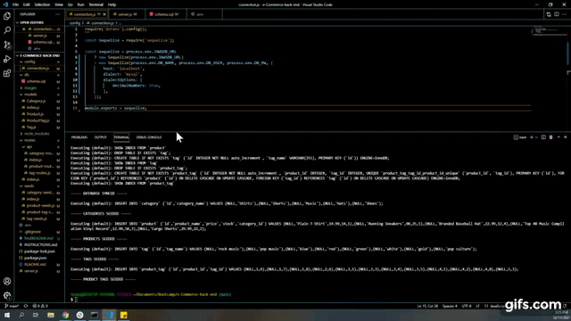
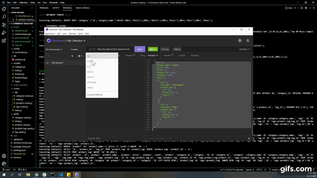

# e-commerce-back-end
## 13 Object-Relational Mapping (ORM): E-Commerce Back End

## TASK: 
The task was to build the back end for an e-commerce site by modifying starter code by configuring a working Express.js API to use Sequelize to interact with a MySQL database.

## USER STORY

```md
AS A manager at an internet retail company
I WANT a back end for my e-commerce website that uses the latest technologies
SO THAT my company can compete with other e-commerce companies
```

## APP DEMOS: 

- Create Schema and Seed data



- GET routes to return all categories, tags, and products


- GET routes to return a single category, tag, or product


- POST, PUT, and DELETE routes for categories


- POST, PUT, and DELETE routes for tags


- POST, PUT, and DELETE routes for products




## VIDEO LINKS:
- [Create schema and seed data](https://www.youtube.com/watch?v=Z6M2BJBfYtg)
- [GET routes to return all categories, tags and products](https://www.youtube.com/watch?v=UzgLXSlLsek)
- [GET routes to return a single category, tag or product](https://www.youtube.com/watch?v=_uieKIYepBs)
- [POST, PUT, and DELETE routes for categories](https://www.youtube.com/watch?v=y-2Uf2FoeM8)
- [POST, PUT, and DELETE routes for tags](https://www.youtube.com/watch?v=hznRtvlBxwE)
- [POST, PUT, and DELETE routes for products](https://www.youtube.com/watch?v=uX9B6cQHK34)


## CONTACT ME:
 [Github](https://github.com/bripap)  
